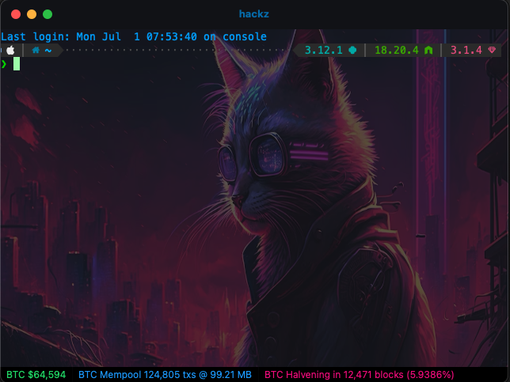
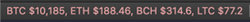
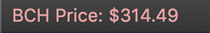
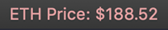
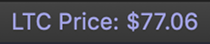
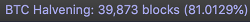
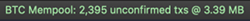

# iterm-crypto-status-bar-components
Custom crypto related status bar components for use with iTerm2.

## Installation & Configuration
1. Clone repo to desired location.
2. From project root, install components to iTerm2's AutoLaunch folder automagically via `bash ./install.sh`.
3. Completely quit and then reopen iTerm2.
4. Follow [the instructions for using status bar components](https://www.iterm2.com/3.3/documentation-status-bar.html) and drag them where you like.

**Notes**
1. You may be prompted to download, configure and activate the Python runtime for iTerm.
2. Enabling "Prefer tight packing to stable positioning" in **Status Bar > Advanced Settings** may result in a better display if multiple components are used.

## Components Overview

### Market Prices

Displays BTC, ETH, BCH and LTC prices in USD. Updates every 30 seconds.

### Bitcoin Price

Displays the current Bitcoin price in USD. Updates every 30 seconds.

### Bitcoin Cash Price

Displays the current Bitcoin Cash price in USD. Updates every 30 seconds.

### Ethereum Price

Displays the current Ethereum price in USD. Updates every 30 seconds.

### Litecoin Price

Displays the current Litecoin price in USD. Updates every 30 seconds.

### Bitcoin Halvening Countdown

Displays the Bitcoin halvening completion percentage and the number of unmined blocks to be found before the halvening.  Updates every 5 minutes.

### Bitcoin Mempool

Display Bitcoin mempool unconfirmed transaction count and size in MB. Updates every 60 seconds.

## Contribute
Bug reports/fixes, feature requests and feedback is welcomed.

## Donate
Find these components fun and/or useful? Donations are also fun 🤓

* **BTC**: `1MoWaXULg56CFR82hKfRPvNLPVqWAdL7m6`
* **ETH**: `0x2C015C09C4ce9eEbC4ff1F9BbdD189e0f05b922f`
* **BCH**: `qzj24j0u2mt9xqwxynjyjgwwrv6c603jtv7v6guyxn`
