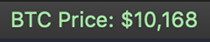

# iterm-btc-status-bar-components
Custom Bitcoin (BTC) related status bar components for use with iTerm2

## Installation & Configuration
1. Clone repo to desired location
2. Install scripts to iTerm2's AutoLaunch folder with via `bash ./install.sh`
3. Close and relaunch iTerm
4. Follow [the instructions for using status bar components](https://www.iterm2.com/3.3/documentation-status-bar.html) and drag them where you like.

**Note** You may be prompted to download, configure and activate the Python runtime for iTerm.

## Components Overview

### Bitcoin Price

Shows the current Bitcoin price in USD.

## TODOs
- [ ] Component: ETH Price
- [ ] Component: LTC Price
- [ ] Component: BTC Halvening countdown
- [ ] Upgrade: BTC Price: Choose fiat currency
- [ ] Upgrade: BTC Price: Show 24hr increase or decrease icon
